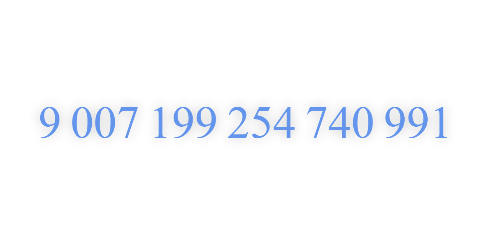

It's the demo site. 

It just shows JavaScript's `MAX_SAFE_INTEGER` value. 
9007199254740991.
With formatting. At the center.

And it changes the color on the click with no unexpected text selection on double click.

That's all.

[Here's the link](https://alttiri.github.io/formatted-number/)

---

You can also load the developer version of Vue.js by specifying the search parameters of the URL.
(It allows you to debug the site with [Vue.js devtools](https://chrome.google.com/webstore/detail/vuejs-devtools/nhdogjmejiglipccpnnnanhbledajbpd).)

Here is: [?dev=true](https://alttiri.github.io/formatted-number/?dev=true)

It also has the debuggable Source Maps:

...and auto-deployng to Github Pages by Github Actions.
